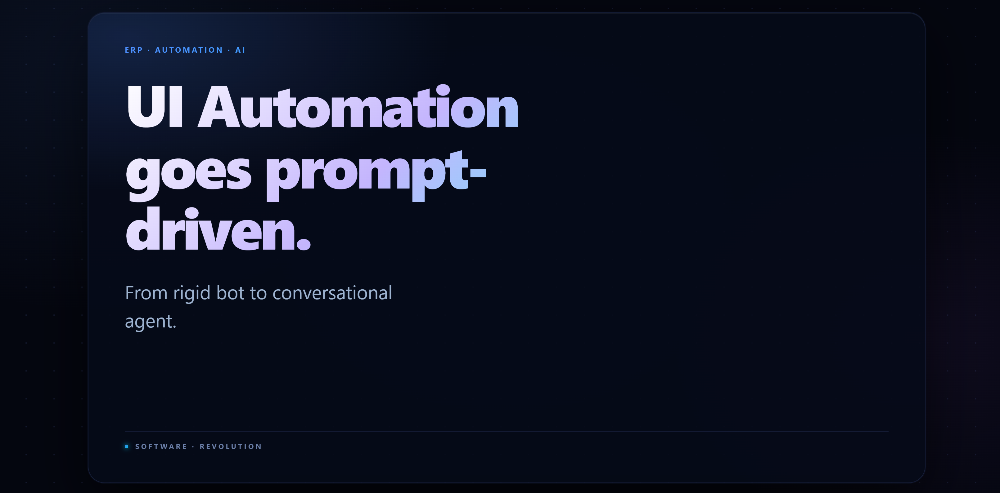
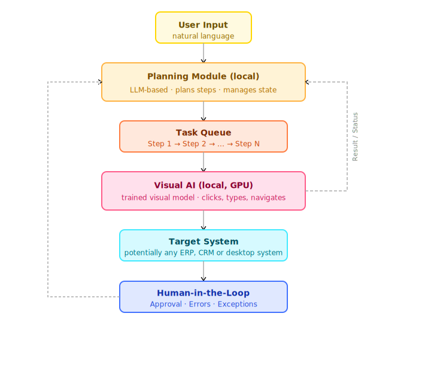

# AI RPA PoC



This project is a proof of concept for AI-driven ERP and CRM automation at the user interface level.

The core idea is simple: if a system can be operated by a human through its UI, it can also be operated by Python through the UI layer. That includes browser-based ERP and CRM systems as well as desktop applications, including legacy environments.

This repository combines:

- a FastAPI backend
- a lightweight web chat frontend
- a planner/orchestrator LLM
- a UI-acting visual model, currently CogAgent
- an execution layer for clicks, typing, scrolling, and keyboard input
- an early Excel ingestion and result write-back flow

## Table of Contents

- [What This PoC Demonstrates](#what-this-poc-demonstrates)
- [High-Level Architecture](#high-level-architecture)
- [Current Model Roles](#current-model-roles)
- [How The Models Work In Code](#how-the-models-work-in-code)
- [Workflow](#workflow)
- [Status of the Excel Flow](#status-of-the-excel-flow)
- [Why This Works](#why-this-works)
- [Model Layer Is Interchangeable](#model-layer-is-interchangeable)
- [Current Technical Components](#current-technical-components)
- [Reliability Strategy](#reliability-strategy)
- [Performance and Optimization Notes](#performance-and-optimization-notes)
- [Potential Improvements](#potential-improvements)
- [Scope and Limitations](#scope-and-limitations)
- [Current Operating Assumptions](#current-operating-assumptions)
- [Repository Structure](#repository-structure)
- [Running the PoC](#running-the-poc)
- [Summary](#summary)

## What This PoC Demonstrates

The PoC shows how natural-language instructions can be translated into executable UI actions against business software.

Example use cases:

- navigate through a browser-based ERP or CRM
- click buttons and links
- fill forms
- select dropdown values
- scroll and confirm actions
- process rows from Excel and write results back

The current implementation is centered around an ERP workflow, but the architectural pattern is broader than ERP. The same approach can be applied to CRM systems, internal line-of-business tools, and older desktop software where API-based integration is unavailable, incomplete, or too expensive to maintain.

## High-Level Architecture



The system is split into four runtime layers:

1. Frontend
The UI in [frontend/index.html](frontend/index.html) provides a chat-style interface for operators. It supports:

- plain English task input
- Excel file upload
- progress feedback
- model status indicators
- screenshot previews after actions

2. API and Session Layer
The FastAPI server in [backend/main.py](backend/main.py) acts as the runtime coordinator. It:

- serves the frontend
- manages WebSocket sessions
- handles chat requests
- handles file uploads
- routes tasks either to planning or direct execution
- tracks per-session action history

3. Planning Layer
The orchestrator in [backend/orchestrator.py](backend/orchestrator.py) converts user intent into a step template. It can:

- answer basic chat requests
- generate step sequences for structured workflows
- save reusable execution jobs
- run with a local LLM or fall back to a rules-based path

4. UI Execution Layer
The executor in [backend/executor.py](backend/executor.py) is responsible for actual UI operation. It:

- takes screenshots
- prompts the visual UI model, which is currently loaded from `ui/` as CogAgent
- parses grounded actions such as `CLICK`, `TYPE`, `PRESS_KEY`, and `SCROLL`
- executes those actions through Python UI automation
- uses OCR as an additional targeting and recovery mechanism
- re-screens after actions to detect change

## Current Model Roles

The current codebase uses two different model roles that should not be conflated:

- `llm/` contains the planning LLM used by the orchestrator
- `ui/` contains the visual action model used by the executor

In the current implementation, the planning side is set up for a local LLM such as Gemma, while the visual side is implemented with CogAgent.

That distinction matters:

- the LLM does not click on the screen
- CogAgent does not own the overall business workflow

The LLM is responsible for intent interpretation, lightweight dialog, and step decomposition. It turns a user request into a sequence of smaller UI tasks or falls back to a simpler rules-based behavior if no planner model is available.

CogAgent is the visual model in the execution layer. It receives a screenshot, the current task, and the recent action history. It then returns a grounded UI action proposal that the executor parses and turns into deterministic mouse or keyboard input.

In other words, CogAgent is not the whole AI in this repository. It is the vision-based acting component inside a larger runtime that also includes orchestration, OCR, validation, and Python-side execution.

## How The Models Work In Code

The role split is not just conceptual. It is visible directly in the runtime code.

1. Request routing in [backend/main.py](backend/main.py)
`handle_chat()` decides whether the request is:

- an Excel-driven planning flow
- an orchestrated multi-step UI execution
- a direct UI action
- or a plain LLM-style chat fallback

If `executor.cogagent_ready()` is true, the backend routes into `_orchestrated_execute()` or `_direct_cogagent()`. If CogAgent is not available, the request stays on the orchestrator side and `orchestrator.chat()` answers without UI control.

2. Planning LLM in [backend/orchestrator.py](backend/orchestrator.py)
The planner side is implemented in the `Orchestrator` class:

- `_load_model()` loads the tokenizer from `llm/` at startup
- `_load_model_gpu()` loads the actual planner LLM onto the GPU only when needed
- `_generate()` runs inference and unloads the model again afterward
- `chat()` handles basic assistant replies
- `plan()` generates a structured JSON step template for spreadsheet-driven workflows
- `_fallback()` keeps the system usable even if the planner model is not available

So the LLM is not the click executor. In code, it is the planning and text-generation component.

3. CogAgent in [backend/executor.py](backend/executor.py)
The visual acting side is implemented in the `ERPExecutor` class:

- `_load_cogagent()` loads CogAgent from `ui/` and applies runtime compatibility patches required by the current local setup
- the executor captures the current application window as an image
- `_ask_cogagent()` sends screenshot, task, and history to the model in a grounded action format
- `_parse_cogagent_output()` turns the model response into structured actions such as `click`, `type`, `scroll`, or `key`
- OCR is used as an additional targeting and recovery layer when text-based clicks are more reliable than raw model coordinates

So CogAgent is the visual decision component that proposes the next UI action from the screenshot context.

4. Deterministic execution after the model call
The actual mouse and keyboard execution is then carried out by Python-side automation. In the current flow, `_cogagent_step()` in [backend/main.py](backend/main.py) bridges the visual model result to concrete UI actions and returns the updated screenshot and status back to the frontend.

That is why the codebase separates three concerns cleanly:

- the LLM interprets and plans
- CogAgent sees the UI and proposes grounded actions
- Python executes those actions deterministically

## Workflow

At a technical level, the runtime flow looks like this:

1. The user sends a natural-language instruction or uploads an Excel file.
2. The backend decides whether the task should be planned first or executed directly.
3. The orchestrator decomposes the work into steps when needed.
4. The executor captures the relevant UI state as a screenshot.
5. The UI model receives the screenshot plus task context and returns an action proposal.
6. The executor validates and performs the action using mouse/keyboard automation.
7. The system captures the post-action state, updates history, and proceeds to the next step.

For spreadsheet-driven workflows:

1. The Excel parser reads the source file.
2. Columns are normalized against known aliases.
3. A step template is generated once.
4. The template is replayed row by row.
5. Results and failures are written back to a result workbook.

The Excel logic is implemented in [backend/excel_parser.py](backend/excel_parser.py).

## Status of the Excel Flow

The spreadsheet-driven path was one of the original ideas for this project and was introduced very early by the project author. It remains in the repository as a useful sketch of how structured batch input can be layered on top of UI automation.

During the PoC itself, however, that branch was not pursued further with the same focus as the direct UI execution path. The Excel-related code should therefore be read as an exploratory start, not as the most validated or most complete part of the current system.

## Why This Works

The PoC relies on a practical observation: many ERP and CRM tasks are already standardized at the UI level.

Once the system can:

- see the screen
- identify actionable UI targets
- express actions in a constrained format
- execute them reliably

the remaining work becomes workflow design, testing, validation, and bounded execution.

One key finding from this PoC is that prompting becomes much more predictable when the workflow is expressed at click level. In practice, the prompt starts to behave less like an open-ended instruction and more like an execution grammar.

That is important, because reliability in UI automation is not primarily a language problem. It is a constraint and validation problem.

## Model Layer Is Interchangeable

The model choices in this repository are implementation details, not architectural requirements.

The system separates:

- a planning LLM for workflow decomposition
- a visual UI model for grounded action prediction

Those models are intentionally swappable.

This applies in both directions:

- CogAgent can be replaced by another vision-language or UI-agent model
- the planning LLM can be replaced by another local model or by a hosted API model

The current repository layout reflects that separation directly:

- `llm/` is the planner slot
- `ui/` is the visual model slot

What must stay stable is the contract around each slot.

For the planner LLM, the contract is about producing usable workflow structure or concise planning output.

For the visual model, the contract is about consuming screenshot context and returning grounded actions in a constrained format that the executor can validate and execute.

This means the stack can be adapted to:

- different local models
- hosted APIs
- lighter models for cost-sensitive deployments
- stronger models for difficult screens
- specialized OCR or vision components

The important contract is not the exact model family. The important contract is the interface:

- input context
- screenshot or UI state
- constrained action output
- deterministic execution boundary

That is the key architectural point: the PoC is not tied to CogAgent as a brand name, and it is not tied to one specific LLM family either. The architecture depends on role separation and stable execution contracts, not on one fixed model vendor or checkpoint.

## Current Technical Components

Based on the current codebase, the PoC uses:

- `FastAPI` and `uvicorn` for the backend service
- `WebSocket` communication for live interaction
- `transformers`, `torch`, `accelerate`, and `bitsandbytes` for local model runtime
- `pyautogui` and `pygetwindow` for UI control
- `pytesseract` for OCR-based fallback targeting
- `pandas`, `openpyxl`, and `xlrd` for spreadsheet handling
- `Pillow` for screenshot processing

Dependency definitions are in [requirements.txt](requirements.txt).

## Reliability Strategy

This repository is a PoC, so reliability is not yet governed at production level. The right path to scale is not “more prompting,” but tighter execution boundaries.

At scale, reliability should be governed through:

- constrained execution scopes
- strong test cases
- validation checkpoints
- app-specific tuning
- explicit retry and recovery logic
- per-workflow acceptance criteria
- environment-specific calibration for screen layouts, OCR quality, and input timing

The current code already hints at that direction by combining:

- step decomposition
- OCR fallback
- action parsing
- screen-change detection
- row-by-row batch execution

## Performance and Optimization Notes

This first version should be read as a baseline pipeline, not as an optimized runtime.

One observed profile on a local setup was:

- GPU load: 100%
- VRAM usage: 1%
- power: 23%
- temperature: 52°C

That profile should not be mistaken for the actual limit of the approach.

The current runtime still includes several intentionally simple choices:

- full-screen screenshots
- a general-purpose vision model
- synchronous waits between actions
- limited reuse of prior UI context

Performance-focused optimization areas include:

- focusing only on the relevant screen region instead of the full interface
- caching static UI elements instead of reprocessing them every step
- reducing synchronous wait times between actions
- improving screenshot and image preprocessing
- tightening prompt formats
- caching or reusing context more effectively
- replacing heavyweight model calls for simple actions with cheaper deterministic handlers
- routing only ambiguous steps to the vision model
- tuning OCR-first vs. model-first decision logic
- improving batching and model invocation efficiency

The practical point is that the present runtime profile reflects an early implementation, not the architectural ceiling. In legacy environments, a few seconds of inference per workflow step may still be acceptable if that avoids far larger migration or integration costs.

## Potential Improvements

The next major steps are less about raw speed and more about turning the PoC into a more controlled automation system.

Promising directions include:

- introducing workflow-specific validators before and after critical actions
- defining per-application test suites and acceptance criteria
- improving logging, tracing, and auditability
- adding stronger approval boundaries and execution policies
- classifying failures more clearly and attaching recovery strategies
- training or distilling smaller workflow-specific models from recorded executions
- separating generic execution logic more cleanly from workflow-specific adapters
- hardening session isolation and multi-user behavior
- making application-specific calibration and configuration more explicit

Those improvements do not change the core idea of the PoC. They make the system easier to trust, test, and operate.

## Scope and Limitations

This is a PoC, not a production-ready automation platform.

Current limitations include:

- environment-specific assumptions
- reliance on visible UI state
- susceptibility to layout changes
- sensitivity to OCR quality and screen resolution
- limited hard guarantees around correctness
- basic fallback logic rather than full policy enforcement
- minimal formal observability, audit, and rollback controls
- limited concurrency hardening and session isolation
- compatibility workarounds tied to the current local model/runtime setup

## Current Operating Assumptions

The current code assumes a fairly specific local setup:

- a Windows desktop environment with real foreground UI control through `pyautogui` and `pygetwindow`
- a visible, focusable target window; the executor currently searches for titles such as `Edge`, `Internet Explorer`, `ERP`, and `localhost`
- local OCR availability via `tesseract`
- local model assets in `llm/` and `ui/`
- trusted local usage only; the backend currently exposes open CORS and does not implement authentication
- local runtime patching for CogAgent compatibility, including patching parts of the installed `transformers` package on disk
- single-host PoC assumptions; global runtime state is not yet hardened for real multi-user parallel execution

Those assumptions are acceptable for a PoC, but they should be treated as explicit constraints rather than hidden defaults.

## Repository Structure

```text
backend/
  main.py            FastAPI entrypoint and runtime coordination
  orchestrator.py    Planning model and workflow template generation
  executor.py        Screenshot capture, UI model prompting, action execution
  excel_parser.py    Spreadsheet normalization and result write-back
  config.ini         Local runtime configuration

frontend/
  index.html         Chat UI

uploads/
  uploaded source files and local runtime artifacts

jobs/
  generated workflow jobs

tools/
  debug/             inspection helpers for model/cache issues
  maintenance/       one-off repair scripts
  manual-ui/         interactive CogAgent checks and click experiments

ui/
  visual model assets, currently CogAgent

llm/
  planner LLM assets
```

## Running the PoC

Typical local setup:

1. Install Python dependencies.
2. Make sure OCR and UI automation prerequisites are available on the host.
3. Place the planner LLM in `llm/`.
4. Place the visual UI model in `ui/`.
5. Start the backend.
6. Open the frontend in a browser.

With the current code, that usually means:

- a planner model in `llm/` such as Gemma or another compatible LLM
- CogAgent in `ui/`, or another compatible visual model if the executor contract is adapted accordingly

On Windows, helper scripts are available in [setup.bat](setup.bat) and [start.bat](start.bat).

Diagnostics, maintenance helpers, and interactive UI-debug scripts are grouped under `tools/` so the repository root stays focused on the main runtime entrypoints.

## Summary

This repository is a technical proof of concept for UI-level automation of ERP and CRM workflows across browser-based and desktop software.

Its main architectural claim is:

- the application can be treated as a visible operating surface
- CogAgent is the current visual acting model, not the whole system
- the planning LLM and the visual model can be swapped independently
- reliability improves when actions are constrained at click level
- productionization depends less on “smarter prompts” and more on bounded execution, testing, and validation

That makes the project useful less as a finished product and more as a concrete reference implementation for building the next, more controlled version.
